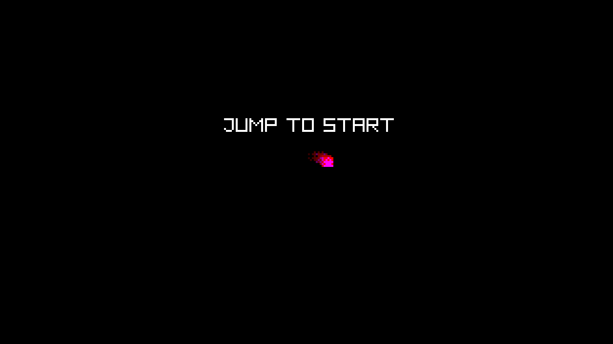
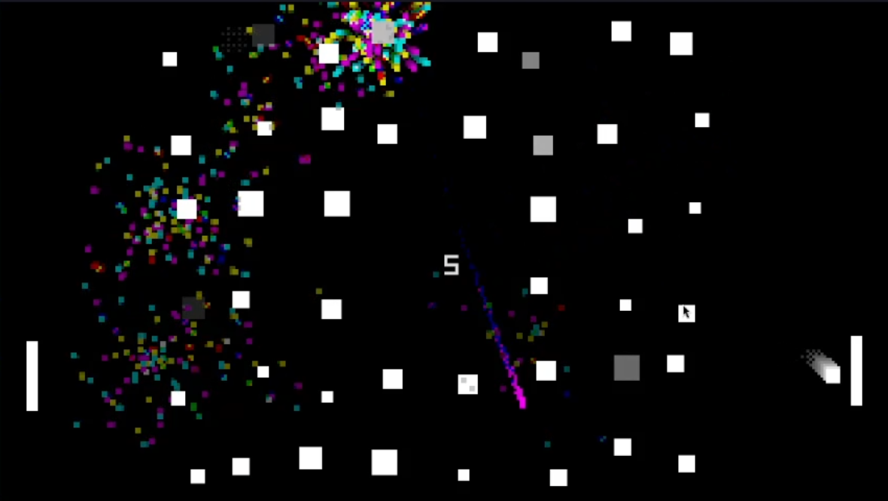

# !pong
What would Pong look like in a parallel universe? !pong ("not pong") lets you jump into that parallel universe, filled with cheap rockets and spacey rocks: see how far you can get without bumping into something! hit the pads as they move, dodge the obstacles, and maybe get some help from magic rainbow crystals scattered in space. 

The original concept is heavily inspired by <https://www.lessmilk.com/almost-pong/>

# Usage
## Controls
### Mouse
Left click -> jump

Right click -> sprint

### Keyboard
Arrow up | Space -> jump

Arrow left/right | Z -> sprint

### Touchscreen
Tap -> jump

Swipe left/right -> toggle sprint

## Running the game
If you just want to play the game, head over to [releases](https://github.com/amari-calipso/not-pong/releases), or try it online at <https://amari-calipso.github.io/not-pong/play/>!

If you're running or building from source, make sure that your machine has installed:
- [raylib's dependencies](https://github.com/raysan5/raylib/wiki);
- [raylib-rs's dependencies](https://github.com/raylib-rs/raylib-rs?tab=readme-ov-file#build-dependencies);
    - Note that release candidate versions of [CMake](https://cmake.org/), marked as "rc", might not work.
- If you're compiling for web platforms, [Emscripten](https://emscripten.org/).

To run or build from source, clone the repository first, then you have a few options:
- To run directly, just use `cargo run`.
- To run in the browser, run:
    - Unix-like: `rustc dev_util.rs -o dev_util && ./dev_util --run-wasm`
    - Windows: `rustc dev_util.rs -o dev_util.exe && dev_util --run-wasm`
- To package a release, (a dist folder containing the release will be created, note that **any previously existing `dist` folders will be deleted**): 
    - If releasing for desktop platforms:
        - Unix-like: `rustc dev_util.rs -o dev_util && ./dev_util --release`
        - Windows: `rustc dev_util.rs -o dev_util.exe && dev_util --release`
    - If releasing for web:
        - Unix-like: `rustc dev_util.rs -o dev_util && ./dev_util --release-wasm`
        - Windows: `rustc dev_util.rs -o dev_util.exe && dev_util --release-wasm`

# Screenshots

